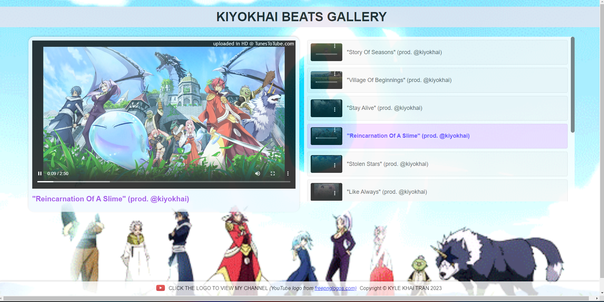
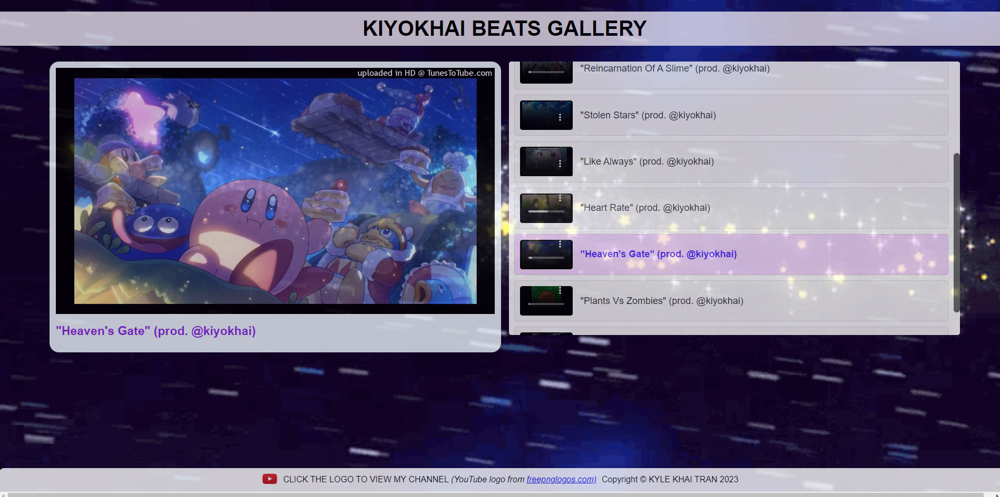

# kiyokhai-beats-player

Welcome to **KIYOKHAI BEATS GALLERY**, a video player showcasing some of my favorite beats as a music producer. The gallery is designed with a user-friendly UI/UX, providing an enjoyable experience for users to explore the beats on any device.

## Usage

The video player is straightforward to use:

- Scroll through the video list on the right-hand side to browse the available beats.
- Click on a video to play it. You can control the playback using the video player controls (play, pause, seek, volume, etc.).
- Click again to pause the video. The main video section on the left will display the selected video with its accompanying beat.

## Technology Used

The project is built using modern web technologies:

- HTML: The foundation of the web pages and content structure.
- CSS: The styling language used to create the visually appealing design of the gallery.
- JavaScript: Used to add interactivity and functionality to the video player.
- Flexbox/Grid: CSS Flexbox and Grid layouts are utilized to create responsive and adaptive designs, ensuring the gallery looks great on various screen sizes and devices.

## Features

The KIYOKHAI BEATS GALLERY boasts the following features:

- Video Player: The custom video player allows seamless control over video playback. Users can easily start, pause, and seek the videos for an uninterrupted viewing experience.
- Custom Background GIFs: Each video in the gallery is paired with a unique background GIF that complements the beat, providing an immersive and artistic experience.
- Responsive Design: The gallery is thoughtfully designed to be fully responsive, adapting to various screen sizes and ensuring an optimal viewing experience on desktops, tablets, and mobile devices.

## Screenshots

## Installation

To explore the KIYOKHAI BEATS GALLERY, simply open oneof the links below in your web browser. No installation is required, and you can instantly enjoy the collection of beats.

- LINK 1 : https://kylekhai.github.io/kiyokhai-beats-player/
- LINK 2: https://kylekhai-beats-gallery.netlify.app/

## Credits

- Background GIFs: The captivating background GIFs used in this project (gif-1 through gif-10) are sourced from giphy.com
- YouTube Icon: The YouTube icon in the footer is obtained from freepnglogos.com, providing an attractive visual link to my YouTube channel.
- Music Videos: All made through FL Studio and deployed through Youtube or via TunesToTube service. 
- **DISCLAIMER: I DO NOT OWN ANY OF THE IMAGES/GIFS!**

## License

This project is licensed under the MIT License, allowing others to use, modify, and distribute the project freely under the specified terms.
